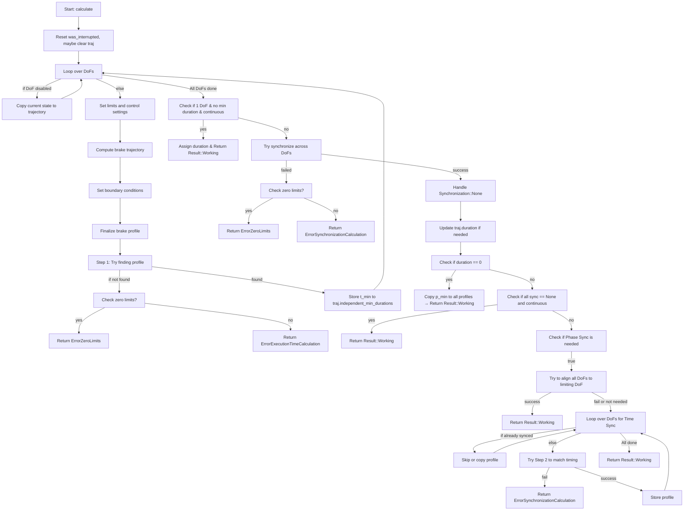

# Swift based Multi DoF Jerk Limited Profiles

- Based upon [Ruckig](https://github.com/pantor/ruckig)

### Major Control Flow



## Citation

If you use this project or build upon it, please cite the following paper:

**Jerk-limited Real-time Trajectory Generation with Arbitrary Target States**  
Lars Berscheid, Torsten Kröger  
_Robotics: Science and Systems XVII_, 2021.

[BibTeX](#bibtex)

---

### BibTeX

```bibtex
@article{berscheid2021jerk,
  title={Jerk-limited Real-time Trajectory Generation with Arbitrary Target States},
  author={Berscheid, Lars and Kr{\"o}ger, Torsten},
  journal={Robotics: Science and Systems XVII},
  year={2021}
}
```

### Notes on Benchmarking:

Cpp Ruckig on Apple M1 Max, 64Gb ~ 2021 provided:

```bash
  Benchmark for 3 DoFs on 262144 trajectories
  Average Calculation Duration 2.427 pm 0.0122862 [µs]
  Worst Calculation Duration 65.1749 pm 19.3034 [µs]
  End-to-end Calculation Duration 2.98597 pm 0.0150864 [µs]
```

Swift Ruckig on Apple M1 Max, 64Gb ~ 2021 provided:

```bash
  Benchmark for 3 DoFs on 262144 trajectories
  Average Calculation Duration 73.65 ± 1.18 [µs]
  Worst Calculation Duration 2397.72 ± 4981.77 [µs]
  End-to-end Calculation Duration 76.79 ± 1.25 [µs]
```

Suspect there are failing conditions which causes the Worst Calculation to jump significantly into the 2.4ms range.

to recreate the Swift benchmarks run:

```bash
make benchmark
```

and to recreate the cPP benchmarks run:

```bash
mkdir -p build
cd build
cmake -DCMAKE_BUILD_TYPE=Release -DBUILD_BENCHMARK=ON -DBUILD_TESTS=ON -DBUILD_EXAMPLES=ON ..
make
./benchmark-target
```


--- 

# Class-Functional Hierarchy


InputParameter + OutputParameter (inout) --> OTG

OTG --> OutputParameter/Trajectory --> Calculator/TargetCalculator (primary calculator)

TargetCalculator --> PositionFirstOrderStep1 ... PositionThirdOrderStep2


